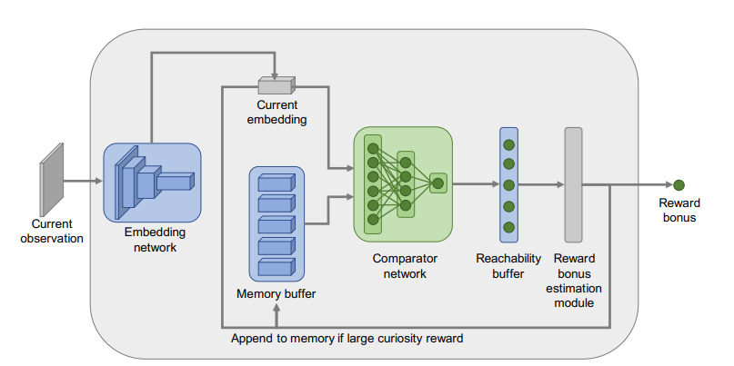
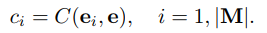
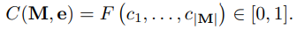
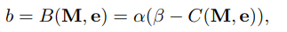

# Practical Deep reinforcement learning algorithms implementation

## Algorithms

- [x] DQN

- [ ] Dueling DQN

- [ ] Doule DQN

- [ ] Dueling Double DQN

- [x] PG

- [x] A2C

- [x] A3C

- [x] DDPG

- [x] PPO

  

  

- [ ] PPO

## Tricks

- [x] Prioritized Experience Replay

- [x] Fixed Q-targets

- [x] Curiosity

- [x] Curiosity By Reachability

  

  

  

  

$$
\hat{r_t} = r_t + b_t
$$

​	The reachability network(embedding and comparator part) is trained as a classification problem for 2 classes. The training data is a series of observations.

## Environments

- [ ] Pong-v0
- [ ] gym-super-mario-bros
- [ ] MontezumaRevenge-v0
- [ ] Enduro-v0
- [ ] CarRacing-v0

## Ideas

World model and curiosity?

extremely large or small reward?